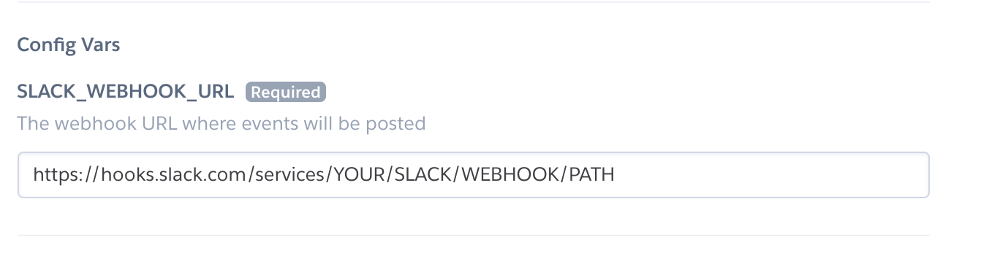
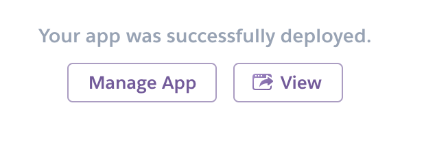

The intent of this project is to show you how simple it is to create custom applications for SHIFT. This example app shows how you can send messages to Slack when new assets are created in SHIFT. You can create an itegration with your own apps or third party services, too. 

There are 3 steps to getting this example app running. It takes 10 minutes. I timed it so I know.

### Step 1

Create a new Incoming Webhook in slack. Be sure to save the webhook URL. You'll need it in a minute.

### Step 2

On the Heroku configuration page you'll see a config for SLACK_WEBHOOK_URL. Put the URL from the previous step into that configuration field.

### Step 3

Visit you new Heroku app by clicking the "View" link at the bottom of the page and create the SHIFT webhook.

### Finally
Any time you create a new asset you will recieve a slack notification.

That's it! You've created a SHIFT app. Congrats!

### Events
This project shows how to use the "asset create" event. But there are many more. See the list below and reference the code in [server.js](server.js) to see how you can make this your own.

#### All events:
* PROJECT.CREATE, PROJECT.UPDATE, PROJECT.DELETE,
 * PROJECT_USERS.CREATE, PROJECT_USERS.UPDATE, PROJECT_USERS.DELETE, 
 * PROJECT_INVITATION.CREATE, PROJECT_INVITATION.UPDATE, PROJECT_INVITATION.DELETE,
 * PROJECT_ROLES.CREATE, PROJECT_ROLES.UPDATE, PROJECT_ROLES.DELETE
 
 * ASSET.CREATE, ASSET.UPDATE, ASSET.DELETE, ASSET.DOWNLOAD,
 * ASSET_METADATA.CREATE, ASSET_METADATA.UPDATE, ASSET_METADATA.DELETE,
 * ASSET_COMMENT.CREATE, ASSET_COMMENT.UPDATE, ASSET_COMMENT.DELETE,
 
 * FOLDER.CREATE, FOLDER.UPDATE, FOLDER.DELETE,
 
 * QUICKLINK.CREATE, QUICKLINK.UPDATE, QUICKLINK.DELETE, QUICKLINK_SHARE.CREATE,
 
 * SESSION.CREATE,
 
 * USER.CREATE, USER.UPDATE, USER.DELETE
 
 